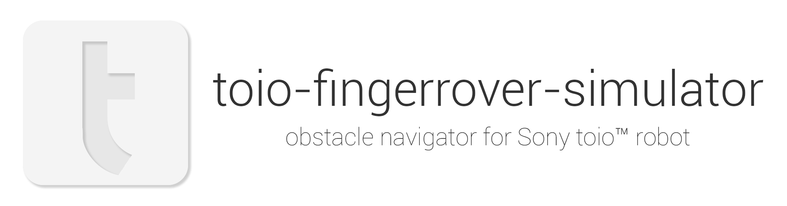
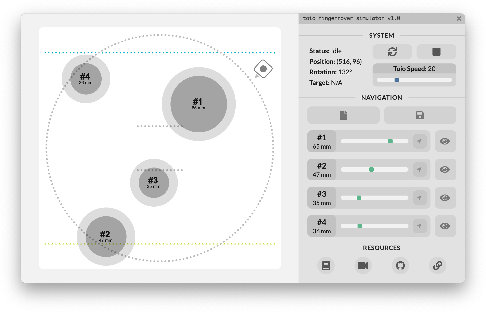
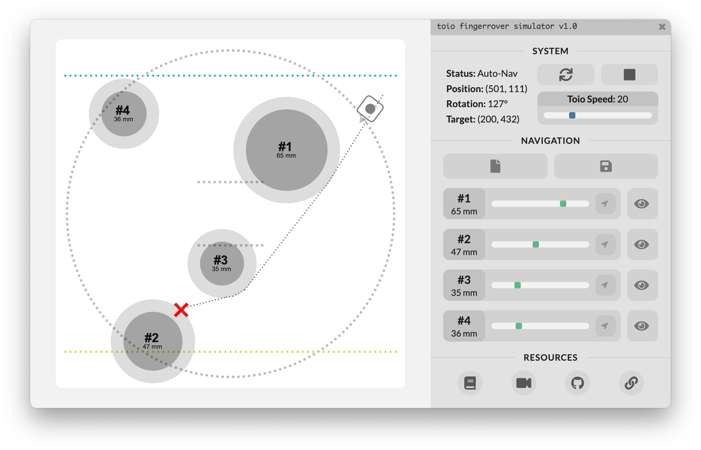
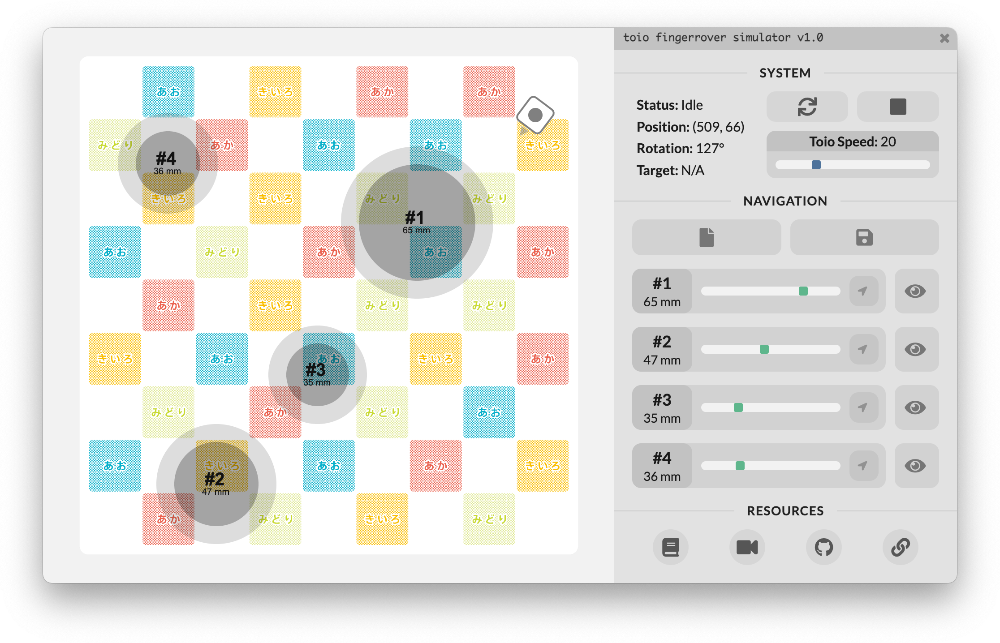

<p align="center" style="pointer-events: none;">
  
</p>
<b>toio-fingerrover-simulator</b> is a virtual obstacle course navigator app for the Sony toio™ robot. Also, as the name suggests, this is also a <i>FingerRover</i> simulator for demonstrating the <i>Locating Object</i> application from our CHI'23 paper <a href="https://doi.org/10.1145/3544548.3581415"><i>Take My Hand: Automated Hand-Based Spatial Guidance for the Visually Impaired</i></a>.

## Getting Started

### Prerequisites
In order to build and run the simulator on your computer, make sure you meet the following prerequisites:

- [**Sony toio™ Robot**](https://www.sony.com/en/SonyInfo/design/stories/toio/)
- [**Play Mat** included with the **toio COLLECTION**](https://toio.github.io/toio-spec/en/docs/hardware_position_id/)
- [**Node.js**](https://nodejs.org/en) >= 10 
- A system that supports [**Noble**](https://github.com/noble/noble). Noble is used internally by the [**toio.js library**](https://github.com/toio/toio.js) for BLE communication.
> This library depends on [noble](https://github.com/noble/noble), so follow [noble's prerequisites](https://github.com/noble/noble#prerequisites) please. <br>
> Windows : needs Bluetooth 4.0 USB adapter. This video is good for beginners - [Bluetooth LE with Node.js and Noble on Windows](https://www.youtube.com/watch?v=mL9B8wuEdms&feature=youtu.be&t=1m46s)

For simulating FingerRover using toio, you will additionally need the following hardware:

- 3D-Printed [**Finger Rest Mount**](./public/assets/toio-fingerrest.stl)
- [**Stainless Steel Ball Bearing**](https://www.mcmaster.com/4668K338/)

**NOTE:** The simulator was tested on an *M1 MacBook Air* running *macOS Ventura 13.0* and [*Node.js v16.13.1*](https://nodejs.org/en/blog/release/v16.13.1)

### Building the Simulator
Once all the prerequisites are met, you can use the commands below to build the simulator:
```
# Clone the repository
git clone https://github.com/adildsw/toio-fingerrover-simulator

# Navigate to project directory
cd toio-fingerrover-simulator

# Install dependencies
npm install

# Build frontend
npm run build
```

## Running the Simulator
Once the simulator is built, you can start the simulator using the following command:
```
npm run prod
```



You can now arrange the virtual obstacles as per your needs, and then click on a target point to automatically navigate toio to that point. Alternatively, you can also use **W S A D** keys to manually control toio.



This simulator supports both sides of the toio COLLECTION play mats, and simply placing the toio on either side will render the corresponding mat on the screen.



## License
MIT License

Copyright (c) 2023 Adil Rahman

Permission is hereby granted, free of charge, to any person obtaining a copy
of this software and associated documentation files (the "Software"), to deal
in the Software without restriction, including without limitation the rights
to use, copy, modify, merge, publish, distribute, sublicense, and/or sell
copies of the Software, and to permit persons to whom the Software is
furnished to do so, subject to the following conditions:

The above copyright notice and this permission notice shall be included in all
copies or substantial portions of the Software.

THE SOFTWARE IS PROVIDED "AS IS", WITHOUT WARRANTY OF ANY KIND, EXPRESS OR
IMPLIED, INCLUDING BUT NOT LIMITED TO THE WARRANTIES OF MERCHANTABILITY,
FITNESS FOR A PARTICULAR PURPOSE AND NONINFRINGEMENT. IN NO EVENT SHALL THE
AUTHORS OR COPYRIGHT HOLDERS BE LIABLE FOR ANY CLAIM, DAMAGES OR OTHER
LIABILITY, WHETHER IN AN ACTION OF CONTRACT, TORT OR OTHERWISE, ARISING FROM,
OUT OF OR IN CONNECTION WITH THE SOFTWARE OR THE USE OR OTHER DEALINGS IN THE
SOFTWARE.
